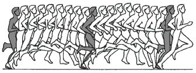
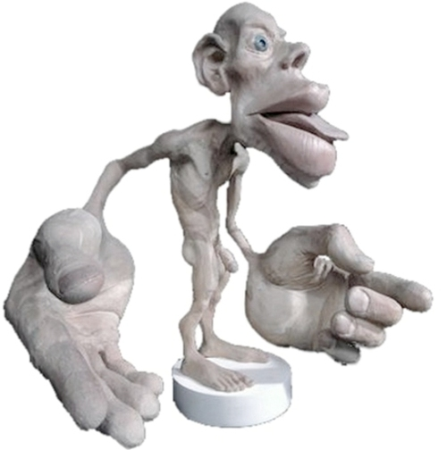

# The Need for a More Sophisticated Humanoid Robot Foot
- tags: #robotics #humanoid-robot #running #bio-mechanics #ideas

Having a look around at the humanoid robots, I've noticed that they are all
"flat footed". Asimo, often regarded as one of the the most sophisticated
humanoid runs like this:

<iframe width="100%" height="400" src="http://www.youtube.com/embed/g9p7-OPvs1c"
frameborder="0" allowfullscreen>
</iframe>

Don't get me wrong it is fast, but its not all that natural, it looks as if the
robot is squatting and running both at the same time. But as an avid runner I
would say it lacks the full running motion we would consider real running. For
example, the robot doesn't actually swing its foot backwards and forwards,
project itself up in the air to increase the stride length.

The challenge for the engineer is the **air time**, it is difficult to engineer
a robot that could co-ordinate it-self to **push-off** with one of their legs,
**project itself** in the air and land on the other **in balance**.

## But why the foot?
Now the reason why I emphasised the foot, is because I believe the foot holds
the key to the whole running motion. When we run we know what **feels right**
and what **doesn't**, not because of the motion sensors in our ears, but
perhaps from our feedback from our foot, legs, arms and body posture. To
reiterate the problem of push-off and landing, the foot in my opinion is one of
the most important body part that dictates the success of this phase, a flat
footed robot (without sensors) is not going to help with this. And here is why:

### Brain's Perception of Our Body
There is a reason why our brains perceive our hands and foot the most. That is
because there is more sensory cortex devoted to these areas. This helps you
make finer movements and have a better sense of touch. So the distances on your
hands, thumb, and cheeks should be smaller compared to your back or your legs
because they are more sensitive.

This above person is called a Homunculus. It is an interesting word. It means
“little man”.  A Canadian doctor by the name of Wilder Penfield while studying
patients with epilepsy created maps of the brain.

### Our Feet are Amazing!
Look at your feet, imagine how difficult it would be to run if you wore wooden
slippers, compared to running on bare feet. With a single foot, there are
exactly **26 bones**, **33 joints** (20 of which are actively articulated), and
more than **a hundred muscles**, **tendons**, and **ligaments**. Nature has't
simply done this by **accident**, there is a reason behind the complex
structure of our foot.

# Summary
In summary, through evolution we have been able to do many amazing complex
things without much thought. Translating our lower motor functions to robots is
one of the most difficult challenges in robotics, as Moravec (1998: 15-16)
said:

> "We are all prodigious Olympians in perceptual and motor areas, so good that
> we make the difficult look easy. Abstract thought, though, is a new trick,
> perhaps less than 100 thousand years old. We have not yet mastered it. It is
> not all that intrinsically difficult; it just seems so when we do it."

In the future, I hope to prove the above with some experimental models that
prove the points above, through **Genetic/Evolutionary algorithms** and a **3D
simulation**. Further more, I hope to one day produce a real humanoid robot
that can actually **run**! :)
