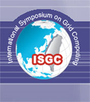

# My First Conference in 1 Months Time - ISGC in Taipei!
- tags: #ISGC #conference #taiwan #taipei #cloud #grid #nosql #database

My first conference in 1 months time, ISGC in Taipei!

Just bought tickets to go to the International Symposium on Grid Computing
(ISGC) 2013 for March! Also my first conference! The topics I will be
discussing are Dr Alex Voss and my experiences in developing a Twitter mining
tool, specifically the No-SQL databases that we have benched marked, and which
No-SQL solution we thought was best for our use cases.

Can’t wait :)
