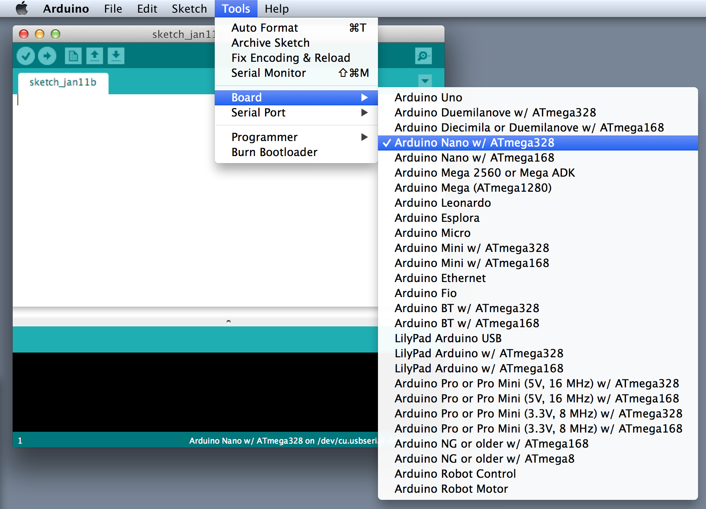
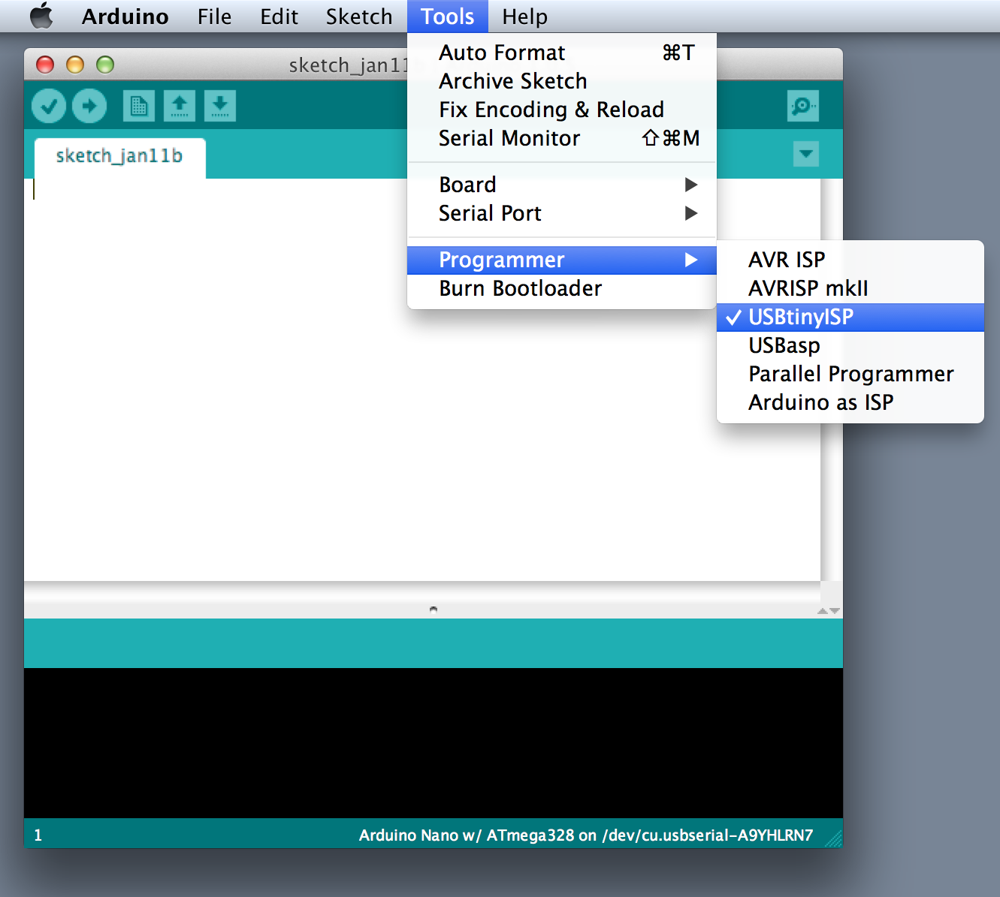
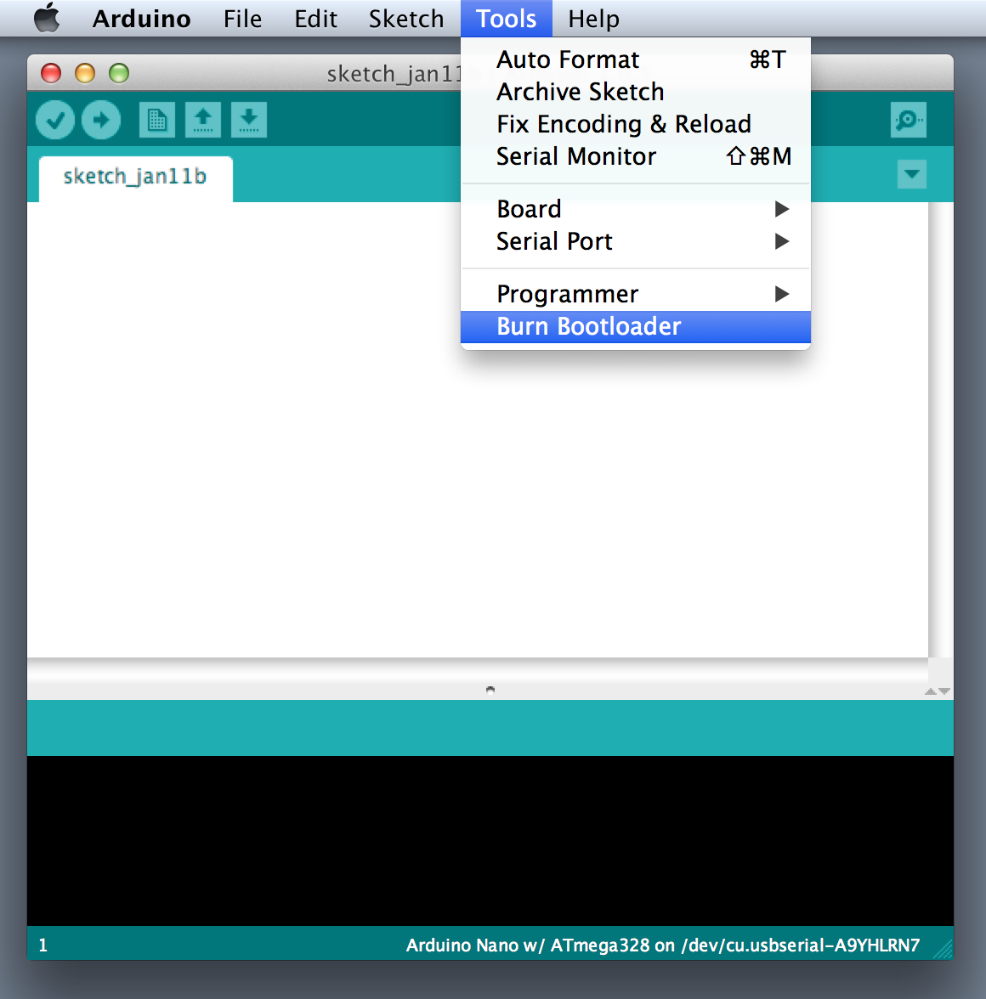
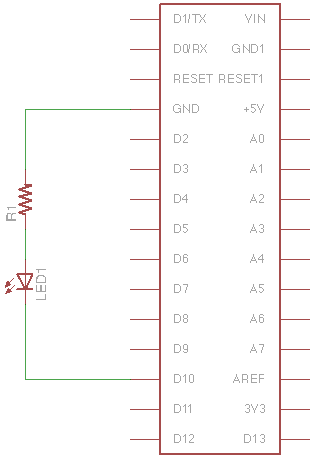
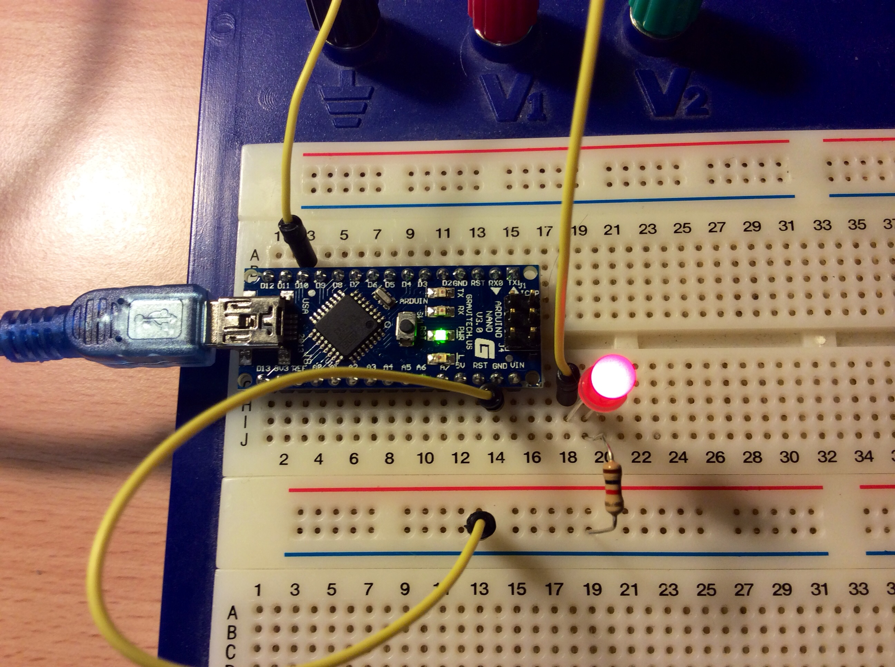

# Hello World with Arduino Nano and MacOSX
Here I'm not going to talk about what Arduino are, I assume you know that
already, what I am going to do is show you how to do make an LED blink using
the Arduino Nano and MacOSX.

Things you will need hardware wise:

- USBTinyISP
- Arduino Nano (v3.0)
- 1 kOhm resistor
- 1 LED (5mm)
- Male-Male jumper wire
- Breadboard (any size)

**Note**: The USBTinyISP is very important, depending on where you buy your
Arduino Nano, it may or may not have the Arduino Bootloader already burned into
the Arduino Nano.

Software wise you have to download and install:

- [Arduino IDE](http://arduino.cc/en/Main/Software) (version 1.0.5 or later)
- [FTDI Chip Driver](http://www.ftdichip.com/Drivers/VCP.htm) (version 2.2.18
  or later)

**Note**: The FTDI Chip driver is very important, without it you won't be able
to communicate with the Arduino Nano.

## What is the Arduino Bootloader?
The Arduino Bootloader is a small bit of code that allows you to transfer your
Arduino Sketches (your chip program) into the Arduino without using an external
programmer. This added convenience means you sacrifice ~2KB of space.

## How do I burn the Arduino Bootloader to the Arduino Nano?
Assuming you have downloaded and installed Arduino IDE and the FTDI chip driver
on your computer:

- Place the Arduino Nano into the breadboard
- Connect the USBTinyISP to both the computer and the Arduino Nano as pictured.

**Note**: You must not connect the Arduino Nano to the computer directly, the
Nano can get its power from the USBTinyISP.

If you have connected everything correctly launch `Arduino.app`. In a new blank
sketch:

- In `Tools > Board ` set board to be burned, in this case its the Arduino Nano
- In `Tools > Programmer` set programmer to USBTinyISP
- Finally in `Tools > Burn Bootloader` burn the bootloader (This will take some
  time)

## Hello World with LEDs
The ability to blink LEDs is really really simple, simply connect the circuit
as follows:

Once you connected the circuit as pictured above, load the following code into
`Arduino.app` and press the "upload" button (or keyboard shortcut: Command +
U):

    int led_pin = 10;  # Digital Pin #10 is were the LED is connected to

    void setup() {
        pinMode(led_pin, OUTPUT);
    }

    void loop() {
        digitalWrite(led_pin, HIGH);
        delay(1000);
        digitalWrite(led_pin, LOW);
        delay(1000);
    }

**Note**: Before you upload the code remember to set the serial port in `Tools >
Serial Port` to `/dev/tty.usbserial-XXXXXX` (or similar). This tells
`Arduino.app` to output through from the USB port. After the sketch has been
successfully loaded, the LED should blink as you programmed it.

## Why the 1kOhm Resistor?
What most Arduino Hello World tutorials don't tell you is why you require that
1kOhm resistor, the reason is to stabilise the LED and avoid too much current
being drawn from Arduino Nano. The digital I/O on the Arduino Nano outputs 5V,
and typically a LED forward voltage (voltage drop across the LED) is about 1.8
to 3.3V depending on the colour.  And so the equation for the correct
resistance is:

\begin{equation}
    R = \frac{
        V_{\text{Power Supply}} - V_{\text{LED voltage drop}}
    }
    {
        I_{\text{LED current}}
    }
\end{equation}

\begin{equation}
    R = \frac{5 - 1.8}{3 \times 10^{-3}}
\end{equation}

\begin{equation}
    R = 1066.6 \text{Ohms}
\end{equation}

The answer is a 1066.6Ohm or 1kOhm resistor is needed. :)
