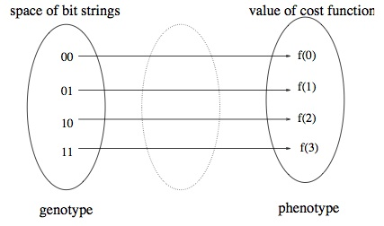
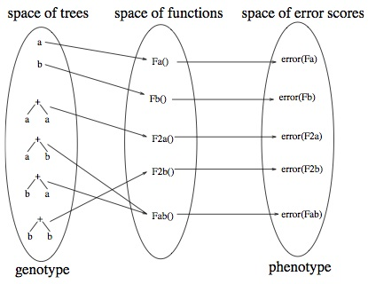

# The No Free Lunch Theorem
I came across a stack overflow question on [finding the best parameters for
solving a problem with Genetic Algorithms][1], there were a few answers however
most of them were wrong. One of the answers argues that the No Free Lunch
theorem states it is pointless. In the following I will  attempt to briefly
explain what that theorem is, and what it means for Evolutionary Algorithms
(EAs), in particular Genetic Algorithms (GA) and Genetic Programming (GP).

The No Free Lunch Theorem (NFLT) was first introduced by Wolpert and Macready
(1997), informally it states if prior assumptions about the optimisation
problem cannot be made and incorporated into the optimisation algorithm, it
cannot be expected to perform better than other algorithms
. Or in other words in black box scenarios if algorithm $x$ performs better
than algorithm $y$ in certain types of problem, it is **equally likely** the
reverse is true for both deterministic and stochastic algorithms such as EAs
[[7][7]].

## Scenarios where No Free Lunch Theorem does not hold
In [[2][2], [3][3], [4][4], [5][5], [6][6]] they show in practice NFLT is only
true approximately, because in reality optimization algorithms may have defined
restrictions on the complexity of the considered functions. The most adequate
example is perhaps a paper by Woodward (2003), he reasoned in some cases that
NFLT does not apply at all.

Woodward (2003) reasoned **the question is not whether the black box in
question is using either GA or GP** to solve optimization problems, **but
rather how the candidate solutions are represented and interpreted**, because
they will both ultimately be represented as a bit string stored in the computer
memory, despite their distinct difference in how each of them represent their
solutions. The key point established was **NFTL assumes a direct one to one
mapping between the space of the search space and "cost" space**, which applies
to GAs most of the time.

GPs on the other hand while it has a one to one direct mapping between the
space of functions and space of "error" scores, the search space between
trees to the functions they represent is many to one (e.g. $a + b$ is the same
as $b + a$ both represent the same function), it is this many to one
representation of trees to functions that invalidates NFLT.

Suppose we have GP algorithm $P$ and $Q$, let $T_p$ and $T_q$ be time-ordered
sets of trees visted by algorithm $P$ and $Q$:

\begin{equation}
    T_p = \\{ +ba, a, b, +aa, +bb, +ab \\}
\end{equation}

\begin{equation}
    T_q = \\{ +ab, +ba, a, b, +aa, +bb \\}
\end{equation}

If $+ab$ is the function we need to solve the problem, then $P$ and $Q$ will
find the solution at their first visit. However for any other function, $P$
will always outperform $Q$ thereby invalidating NFLT.

It is worth reiterating that while in general GA representation and
interpretation is one to one, it can also be made to have a many to many
representation just like GPs and vice versa.

## Conclusion
The introduction of NFLT should not be seen as a limiting factor, on the
contrary it should drive us to define the classes of problems being solved and
algorithms being developed or used more carefully. [[8][8]] argues it is only
then can meaningful discussion on blackbox algorithms begin.

[1]: http://stackoverflow.com/questions/1075628/how-to-find-the-best-parameters-for-a-genetic-algorithm/21119469#21119469
[2]: http://citeseerx.ist.psu.edu/viewdoc/summary?doi=10.1.1.13.892
[3]: http://citeseerx.ist.psu.edu/viewdoc/summary?doi=10.1.1.35.5850
[4]: http://citeseerx.ist.psu.edu/viewdoc/summary?doi=10.1.1.71.8446
[5]: http://citeseerx.ist.psu.edu/viewdoc/summary?doi=10.1.1.68.8247
[6]: http://ieeexplore.ieee.org/xpls/abs_all.jsp?arnumber=1545946
[7]: http://ieeexplore.ieee.org/xpls/abs_all.jsp?arnumber=585893&tag=1
[8]: http://link.springer.com/chapter/10.1007%2F978-3-642-21434-9_1
