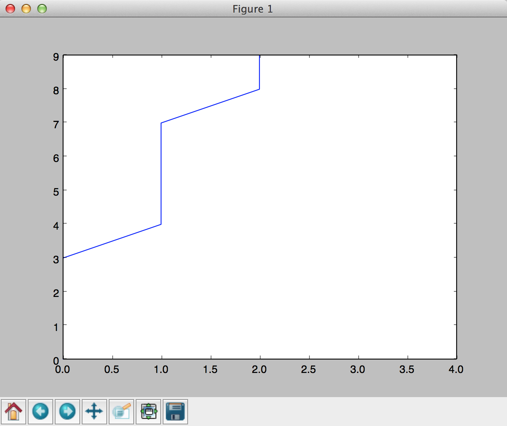

# How to Remove Plot Lines in Matplotlib
In `playground` I wanted to plot a graph live, but instead of plotting multiple
lines, I wanted to remove the last line I plotted. Here's how you do it:

    #!/usr/bin/env python
    from time import sleep

    import numpy as np
    from matplotlib import pyplot as plt

    if __name__ == "__main__":
        # create figure and its subplot
        fig = plt.figure(1)
        ax = fig.add_subplot(1, 1, 1)

        # add lines to plot
        ax.plot(np.arange(10) / 4, np.arange(10))
        ax.plot(np.arange(10) / 2, np.arange(10))

        # show plot for 2 seconds
        plt.show(block=False)
        sleep(2)

        # pop the last line
        ax.lines.pop()

        # refresh the plot for 2 seconds and exit
        plt.draw()
        plt.show(block=False)
        sleep(2)

What you get is this for 2 seconds:

And then this for another 2 seconds:

